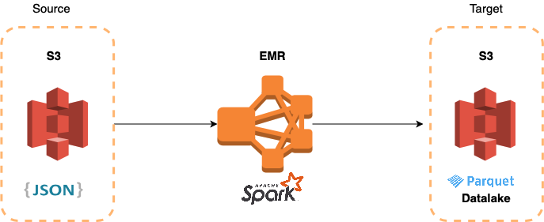
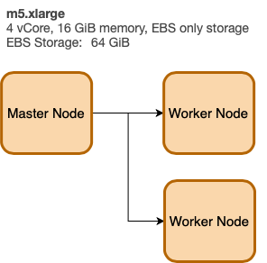
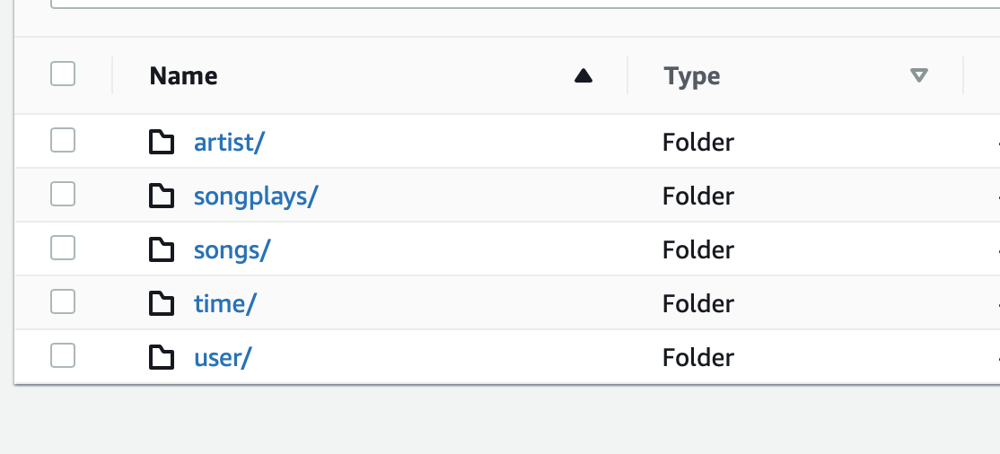
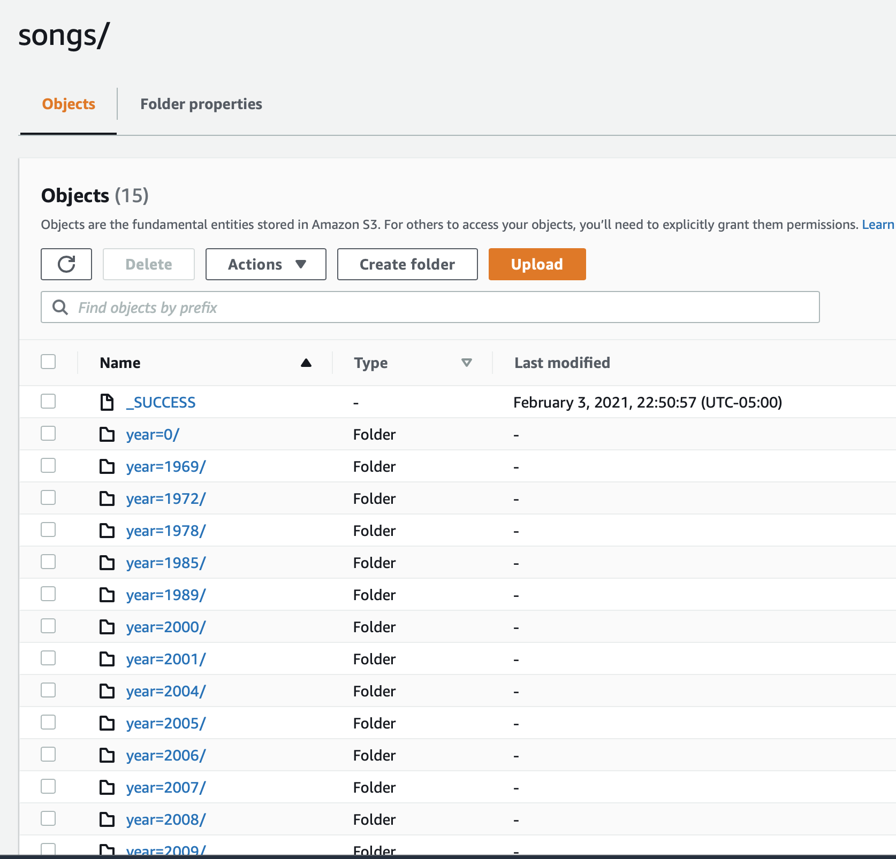

# Use-Case Scenario 

A music streaming startup, **Sparkify**, has grown their user base and song database even more and want to move their data warehouse to a data lake. Their data resides in S3, in a directory of JSON logs on user activity on the app, as well as a directory with JSON metadata on the songs in their app.

As their data engineer, we are tasked with building an ETL pipeline that extracts their data from S3, processes them using Spark, and loads the data back into S3 as a set of dimensional tables. This will allow their analytics team to continue finding insights in what songs their users are listening to.

# Approach

## Spark for ETL and S3 for Data Lake

In this project I am illustrating the use of Spark (PySpark) to perform ETL and create a Data Lake in S3.

The source data are in `JSON` format located in an S3 bucket, which we will extract and then perform transformation to finally push the results back into another dedicated S3 bucket to host our Data Lake files in Parquet format.

Given the number of overall files that we need to read, using a distributed architecture to process the data would be the ideal. In this scenario, we will use AWS EMR, install Spark, based on a `1-Master Cluster` and `2-worker` nodes architecture. 

## Datasets 

#### Song Dataset

The first dataset is a subset of real data from the [Million Song Dataset](https://labrosa.ee.columbia.edu/millionsong/). Each file is in JSON format and contains metadata about a song and the artist of that song. The files are partitioned by the first three letters of each song's track ID. For example, here are filepaths to two files in this dataset.

```txt
song_data/A/B/C/TRABCEI128F424C983.json
song_data/A/A/B/TRAABJL12903CDCF1A.json
```

And below is an example of what a single song file, TRAABJL12903CDCF1A.json, looks like.

```json
{"num_songs": 1, "artist_id": "ARJIE2Y1187B994AB7", "artist_latitude": null, "artist_longitude": null, "artist_location": "", "artist_name": "Line Renaud", "song_id": "SOUPIRU12A6D4FA1E1", "title": "Der Kleine Dompfaff", "duration": 152.92036, "year": 0}
```

#### Log Dataset

The second dataset consists of log files in JSON format generated by this [event simulator](https://github.com/Interana/eventsim) based on the songs in the dataset above. These simulate app activity logs from an imaginary music streaming app based on configuration settings.

The log files in the dataset you'll be working with are partitioned by year and month. For example, here are filepaths to two files in this dataset.

```txt
log_data/2018/11/2018-11-12-events.json
log_data/2018/11/2018-11-13-events.json
```

And below is an example of what the data in a log file, 2018-11-12-events.json, looks like.


## Architecture using AWS EMR

We will leverage AWS to create our solution. The advantage go the cloud is that we can simply spin an EMR cluster, run our ETL job, then terminate the cluster to save on cost. We only pay for the duration of computer power used. 




The EMR cluster consists of a Master Node and 2 Worker Nodes all the same hardware configuration/size (m5 family).

We can easily create our EMR cluster from our terminal (assuming we have AWS CLI installed)

```bash
aws emr create-cluster --name=spark-cluster --release-label emr-5.28.0 --applications Name=Spark --ec2-attributes KeyName=spark-cluster --use-default-roles --instance-type m5.xlarge --instance-count 3
```




We can then transfer our python files using `scp`

```bash
scp -i spark-cluster.pem python_file.py hadoop@ec2-44-242-152-121.us-west-2.compute.amazonaws.com:/home/hadoop/
```

and execute our file simply using `spark-submit`

```bash
spark-submit python_file.py
```

 To monitor progress we can use Spark UI

# SparkSQL APIs

In this project, I used the two API styles available:  **SQL** and **DataFrames** API. The SQL approach is great for those who come from a strong SQL background and feel more comfortable writing SQL queries. You will feel right at home. If you have a Python/Pandas background, then the DataFrames API will feel natural to you.

Example using SQL for ETL:

```python
# get filepath to song data file
song_data = os.path.join(input_data, 'song_data/*/*/*/*.json')
    
# read song data file
df = spark.read.json(song_data)
df.createOrReplaceTempView("songs_data")

# extract columns to create songs table
songs_table = spark.sql("""
                        select distinct
                        song_id,
                        title,
                        artist_id,
                        year,
                        duration 
                        from songs_data
                        """)
# write songs table to parquet files partitioned by year and artist
songs_table.write.partitionBy("year","artist_id").parquet(os.path.join(output_data, "songs"), mode='overwrite')


```

Example using DataFrames API for ETL:

```python
# get filepath to song data file
song_data = os.path.join(input_data, 'song_data/A/A/A/*.json')
    
# read song data file
df = spark.read.json(song_data)

# extract columns to create songs table
songs_table = df.select('song_id', 'title', 'artist_id', 'year', 'duration').dropDuplicates()
    
# write songs table to parquet files partitioned by year and artist
songs_table.write.partitionBy("year","artist_id").parquet(os.path.join(output_data, "songs"), mode='overwrite')
```

It looks very similar but let's look into the details. In the SQL approach, we use `createOrReplaceTempView`, you can think of this as taking our loaded Spark data into a View/Table format that we can use in our queries. The view/table name we specify is the name that we will use in the `from` clause in our queries. 

Now, in the case of DataFrames API, we will need to be familiar with many of the built-in functions that comes available to us. And in some cases, we may need to use `udf` which are **User Defined Functions** when we need to create a custom functions that is not readily available to us.

Here is an example to illustrate the major difference in the approach. Below, we create transformations to extract Month, Day, Year ..etc from a Unix Timestamp (Epoch). The first approach is using pure SQL and the second approach is using DataFrame API.

```python
# using SQL for transformations 
time_table = spark.sql("""
                        select ts, 
                        from_unixtime(ts/1000, "hh:mm:ss") as start_time,
                        from_unixtime(ts/1000, "yyyy-MM-dd") as date,
                        month(from_unixtime(ts/1000, "yyyy-MM-dd")) as month,
                        year(from_unixtime(ts/1000, "yyyy-MM-dd")) as year,
                        day(from_unixtime(ts/1000, "yyyy-MM-dd")) as day,
                        weekofyear(from_unixtime(ts/1000, "yyyy-MM-dd")) as week,
                        hour(from_unixtime(ts/1000, "hh:mm:ss")) as hour,
                        weekday(from_unixtime(ts/1000, "yyyy-MM-dd")) as weekday
                        from log_data
                        where log_data.page = 'NextSong'
                        """)
    
    # write time table to parquet files partitioned by year and month
    time_table.write.partitionBy("year", "month").parquet(os.path.join(output_data, "time"), mode='overwrite')


```

```python
# using Dataframe API for transformations

# We first need to import all the functions that we will need
from pyspark.sql.types import TimestampType
from pyspark.sql.functions import udf, col
from pyspark.sql.functions import year, month, dayofmonth, hour, weekofyear, date_format


# Here we create custom function 'conv_ts' (UDF) and register it. 
@udf(TimestampType())
def conv_ts(ts):
  """
  Function that takes a UNIX timestamp (EPOCH) and converts to DateTime format

  Arguments: Takes in a Unix Timestamp (epoch)
  returns: A datetime value
  """
  return datetime.fromtimestamp(ts/1000)

# We create a new column 'datetime' which is output of the applied udf
df = df.withColumn('datetime', conv_ts('ts'))


time_table = df.select(
                        'ts',
                        'datetime',
                        date_format('datetime','hh:mm:ss').alias('start_time'),
                        year('datetime').alias('year'),
                        month('datetime').alias('month'),
                        dayofmonth('datetime').alias('dayofmonth'),
                        weekofyear('datetime').alias('weekofyear')
                    ).dropDuplicates()
    
 # write time table to parquet files partitioned by year and month
time_table.write.partitionBy("year", "month").parquet(os.path.join(output_data, "time"), mode='overwrite')
```

# S3 for Data Lake

If we compare the approach to the previous project ([Creating a Data Warehouse in AWS Redshift](https://github.com/tatwan/redshift-dw-example-project)) we can easily pin point some key differences

1. We did not need to create or define the schema in advance. No DDL needed. 
2. No need to define Staging Areas as we did when creating the Data Warehouse
3. No database instance: We did not need to spin a Redshift cluster or use AWS RDS to have a running database engine, thus reducing our cost significantly. We used Parquet as an option for an optimized data storage and analytics performance.

The final outcome is shown below



All of our files written into dedicated folders for artist, songs, time, user, and songplays.

And example below of our songs data being portioned by Year then by Artist 



